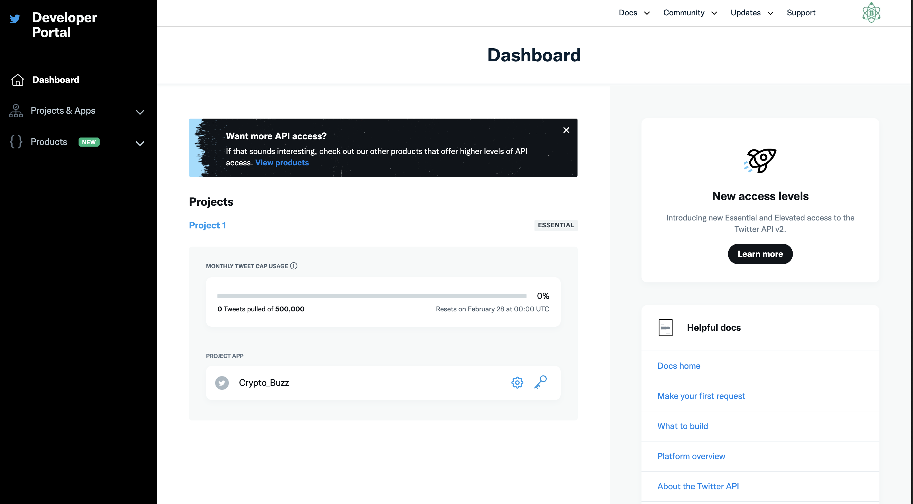

# Auto publish to Twitter

1. Create a Twitter Account, if you don't already have one and associate a [phone number](https://twitter.com/settings/phone) to it

2. Apply for a Twitter Developer Account: 

    - [https://developer.twitter.com/](https://developer.twitter.com/)
    
3. Create an new app:

    - [https://developer.twitter.com/en/apps](https://developer.twitter.com/en/apps)
   
4. Turn on OAuth 1.0, give Read, Write, and Message permissions to the application
    
5. Create the Authentication Credentials:

    - [https://developer.twitter.com/en/portal/dashboard ](https://developer.twitter.com/en/portal/dashboard )
 
    
    
6. Add a github action for posting recurretly on Twitter

    Create an environment `alembik` in the repository and add secrets `MONGO_HOST` and `GHCR_TOKEN` (github token with permission to pull the two private repositories producer/consumer)

    ```yml
    name: Produce and Consume

    # Controls when the workflow will run
    on:

      schedule:
      - cron: '0 */1 * * *'.  # Run every hour

      # Allows you to run this workflow manually from the Actions tab
      workflow_dispatch:

    # A workflow run is made up of one or more jobs that can run sequentially or in parallel
    jobs:
      consume-twitter:
        runs-on: ubuntu-latest
        environment: alembik
        container:
          image: ghcr.io/lucacillario/alembik/alembik-instagram-consumer
          credentials:
             username: ${{ github.actor }}
             password: ${{ secrets.GHCR_TOKEN }}
          env:
            MONGO_HOST: ${{ secrets.MONGO_HOST }}
            MONGO_DB: alembik
            SOCIAL: twitter
            LOGGING_LEVEL: debug
            ACCOUNT: reddit-CryptoCurrency
        steps:
          - name: Consume twitter
            working-directory: /app
            run: python -m alembik
    ```
