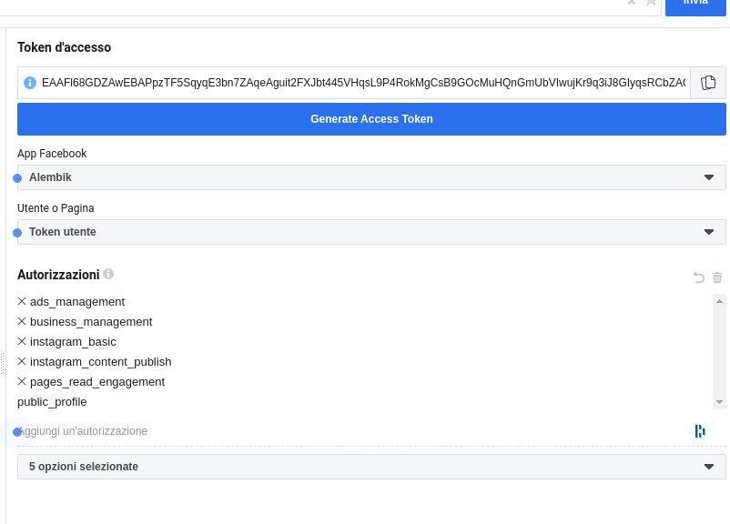

## Update Instagram token

1. Go to [https://developers.facebook.com/apps/393538215044865/dashboard/](https://developers.facebook.com/apps/393538215044865/dashboard/)

2. Tools -> Graph API Explorer -> Generate Access Token

    

3. Exchange with a long live token: 
    `https://graph.facebook.com/oauth/access_token?client_id=393538215044865&client_secret=8a63459b0a43fea013553a77ca861103&grant_type=fb_exchange_token&fb_exchange_token={TOKEN_DI_BREVE_DURATA}`

4. Check for access token status: [https://developers.facebook.com/tools/debug/accesstoken/](https://developers.facebook.com/tools/debug/accesstoken/)
